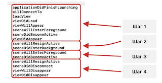

# usov-uikit
Practice from book:

#### *Усов В. Swift. Разработка приложений под iOS на основе фреймворка UIKit. 2021* ####
[Book Site](https://swiftme.ru/)
---
## Structure: ## 

### App Name ### 
> app name 
### Description ###
> App description
### Notes ###
> my notes, some code examples

**#1**

> Commit tag  
---
## LIST OF COMMITED FILES GOES FROM HERE: ⬇️ ##
---
### Right On Target ### 
App life cycle, scene, navigation, AppDelegate, SceneDelegate, MVC, generics, protocols

#### 📓 Notes ####
❗ Tree ways to change the scene 
- Segues (cose scene overloading)
- Present, Dismiss methods (see p.83) 
- Navigation Controller

❗ Life Cycle



**commit #1**

---
### Contacts ###
App for saving contacts (title and phone), it's possible to create or change a contact or delete it. 

Using: 
- User Defaults - (save *struct with self-made coding/decoding to appropriate UD type 
  + 🖕 DON'T DO THAT, as UD only for simple types and data)
  + 🖕 Pay attention: There is far more simple way to code/decode *struct* (conform protcol *Codable*) but it doesn't work with *protocol* only for library      types
    [see here](https://stackoverflow.com/questions/50346052/protocol-extending-encodable-or-codable-does-not-conform-to-it#fromHistory), 
    [and here](https://stackoverflow.com/questions/46337380/conforming-class-to-codable-protocol-in-swift4)
   
- Table View - (reusable cell)
- ToolBar - (add new item)
- Polimorfism with *prortocols*
- Swipe in cell - (*trailingSwipeActionsConfigurationForRowAt* call Alert) 
- Alert - the same allert for adding and changing contacts

**commit #2**
---
### Navigation ###
Sample App - to find out how navigation works.  
Using: 
- Navigation Contriller (❗there is only one  ViewController for working with 3 scenes DON'T DO THAT)
- Create UIView Controller by code from UIStoryboard by stryboardID
- Navigation Stack (DON'T create the same UIView Controller instances in N.Stack, for not consiquently moving).   
  check there is't *-green-* instance in stack:   
  
  ```swift
    // -green- controller is already in stack
    // self.navigationController?.pushViewController(nextViewController, animated: true) WILL CREATE 
    // SECOND -green- nextViewController
    @IBAction func toGreenFromYellowPressed(_ sender: UIButton) {
        guard let controllers = self.navigationController?.viewControllers else { return }
        // avoid making the same instances in Nav. stack
        for controller in controllers {
            if controller.title == "-green-" {
                self.navigationController?.popToViewController(controller, animated: true)
                break
            }
        }
    }
  ```
  - chenge root scene:   
```swift
self.navigationController?.viewControllers[0] = someViewController
```

